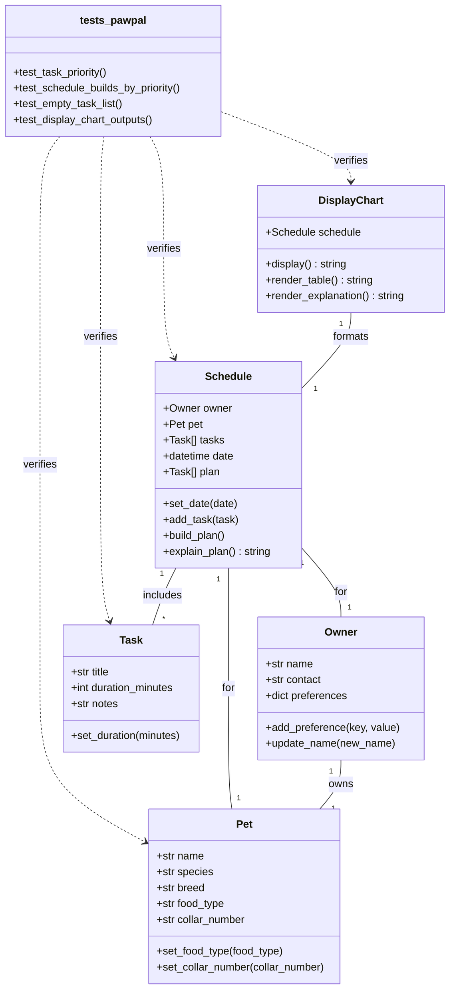

# PawPal+ Class Diagram

```mermaid
classDiagram
    class Owner {
        +str name
        +str contact
        +dict preferences
        +add_preference(key, value)
        +update_name(new_name)
    }

    class Pet {
        +str name
        +str species
        +str breed
        +str food_type
        +str collar_number
        +set_food_type(food_type)
        +set_collar_number(collar_number)
    }

    class Task {
        +str title
        +int duration_minutes
        +str notes
        +set_duration(minutes)
    }

    class Schedule {
        +Owner owner
        +Pet pet
        +Task[] tasks
        +datetime date
        +Task[] plan
        +set_date(date)
        +add_task(task)
        +build_plan()
        +explain_plan() string
    }

    class DisplayChart {
        +Schedule schedule
        +display() string
        +render_table() string
        +render_explanation() string
    }

    class tests_pawpal {
        +test_task_priority()
        +test_schedule_builds_by_priority()
        +test_empty_task_list()
        +test_display_chart_outputs()
    }

    Owner "1" -- "1" Pet : owns
    Schedule "1" -- "1" Owner : for
    Schedule "1" -- "1" Pet : for
    Schedule "1" -- "*" Task : includes
    DisplayChart "1" -- "1" Schedule : formats
    tests_pawpal ..> Task : verifies
    tests_pawpal ..> Schedule : verifies
    tests_pawpal ..> DisplayChart : verifies
    tests_pawpal ..> Pet : verifies
```
